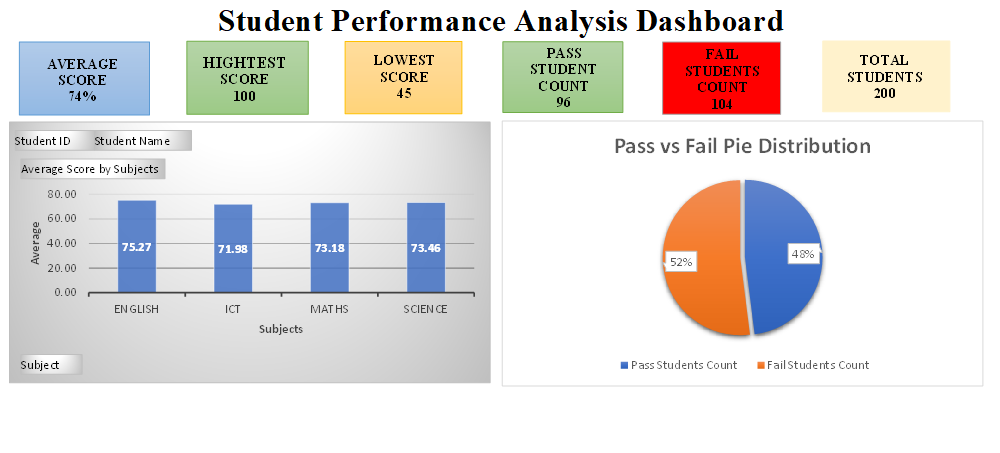

# Student Performance Analysis Dashboard

## Project Overview
This project analyzes student academic performance using Microsoft Excel.

## Features
- KPI Cards
- Average Score Analysis
- Highest & Lowest Score Tracking
- Pass vs Fail Distribution
- Pivot Tables
- Pivot Charts
- Interactive Filters

## Tools Used
- Microsoft Excel
- Pivot Tables
- Pivot Charts
- Excel Functions (IF, COUNTIF, AVERAGE, MAX, MIN)

## Dataset
- 200 Student Records
- Subjects: English, ICT, Maths, Science

## Dashboard Preview

## Key Insights
- Average Score: 74%
- Highest Score: 100
- Lowest Score: 45
- Total Students: 200
- Pass Rate: 48%
- Fail Rate: 52%
